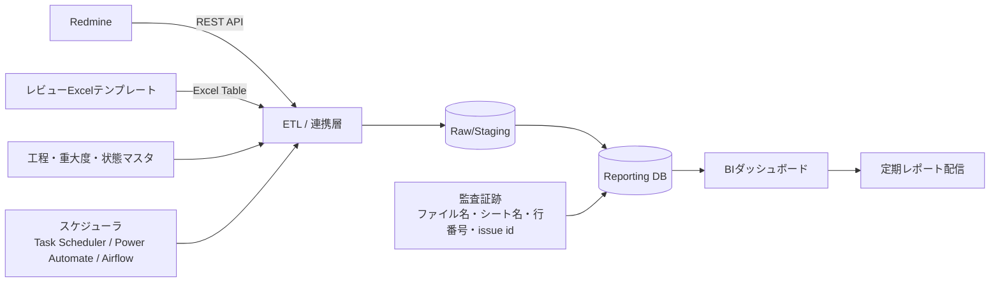
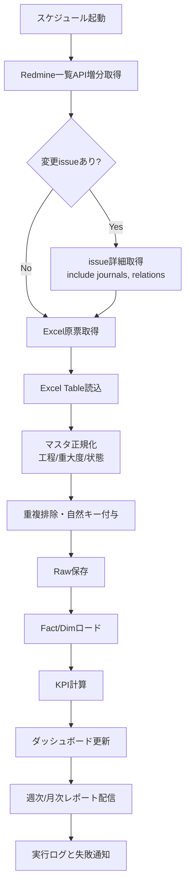
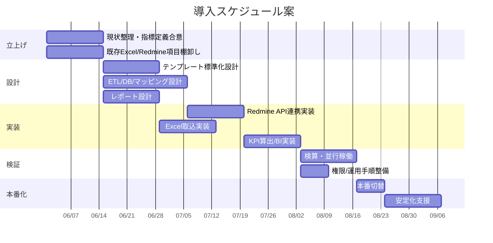

# 自動化によるレビュー指摘・不良指標の集計と定期レポート化の移行提案

## エグゼクティブサマリ

現状は、**Redmineでスケジュールを管理しつつ、レビュー指摘は外部仕様書・内部仕様書・コード・テスト仕様書ごとの専用Excelで管理し、指摘密度・不良除去率・流出率などを手作業で集計して報告している**という構図です。この構図は、入力と集計の自由度が高い一方で、**定義の揺れ、転記ミス、集計遅延、出典追跡の弱さ**が発生しやすく、特に工程横断の品質指標を安定運用するには限界があります。Redmine側はREST APIで認証・ページング・更新日時フィルタ・カスタムフィールド取得に対応していますが、**journalsは一覧APIでは取れず、個票APIでのみ取得可能**です。したがって、手動Excel集計をそのまま自動化するのではなく、**Redmine API＋構造化Excel＋集計用DB＋BI**の分離構成に改めるのが最も現実的です。citeturn19view1turn20view0turn27view0turn5view1

本提案の結論は明確です。**第一推奨は「最小変更で最大効果」を狙うハイブリッド移行**です。具体的には、現場の入力UIとしてExcelを直ちに全廃せず、まずはExcelを**自由記述シートから“Excel Table＋データ検証付きテンプレート”へ標準化**し、RedmineはAPI連携で増分抽出し、両者をレポーティングDBに統合します。その上で、Power BIまたはMetabaseでダッシュボードと定期レポートを自動配信します。この進め方は、Power Query/Excelが**テーブル・名前付き範囲を安定入力源として扱いやすく、シートの見た目依存の取り込みは壊れやすい**という製品仕様とも整合します。citeturn10view0turn10view2turn10view3turn29view0

運用面では、**API優先・RPA例外**を原則に置くべきです。Power AutomateやRPAは有効ですが、デスクトップ自動化は非アテンド実行時にRDPセッションや画面解像度条件の影響を受けるため、**主経路としては脆い**です。一方、Power Automateの**scheduled cloud flow**は定期レポート配信に適しており、Premiumコネクタを使うscheduled flowは**所有者だけがPremiumライセンスを持てばよい**ため、配信だけならコスト効率も悪くありません。citeturn9view5turn9view6turn23search9turn26search0

優先順位が「工数削減」と「実現容易性」であることを踏まえると、初期フェーズで狙うべき成果は次の三つです。  
第一に、**集計工数の恒常的削減**です。入力は従来に近いまま、集計・整形・再計算・報告送付を自動化します。第二に、**指標定義の固定化**です。指摘密度、DDP、DRE、流出率を計算式とデータ起点まで辞書化し、担当者依存を排除します。第三に、**トレーサビリティの確立**です。Excelの行番号・ファイル名・テーブル名、およびRedmine issue id / journalを保持し、監査可能性を持たせます。これにより、単なる“自動集計”ではなく、**説明可能な品質管理基盤**へ移行できます。citeturn14search11turn18search1turn17search2turn16search12turn21view5

## 現状課題と前提

### 現状課題

現状の最大の課題は、**入力系と報告系が同一Excelに密結合**している点です。レビュー記録のための表と、管理報告のための集計表・グラフが同居している場合、少しのレイアウト変更で数式や参照が崩れ、過去月との差分比較や定期運用が属人化しやすくなります。Microsoftは、Excel Tableの構造化参照が**行列追加・削除に追随して自動調整**される一方、任意シートのレイアウトからPower Queryが推定した“suggested table”は、**シート変更が大きいとリフレッシュが正常に続かないことがある**と案内しています。つまり、現行Excelをそのまま対象にした自動化は、短期的には動いても、中期運用で壊れやすいです。citeturn10view0turn10view3

Redmineについては、API活用余地は大きいものの、設計上の注意があります。**一覧APIはページング前提で最大100件/ページ**であり、**updated_onによる増分抽出**や**cf_xによるカスタムフィールド条件**が使えますが、**journalsは一覧APIでは取得できず、個票APIでのみinclude=journalsが有効**です。したがって、全件フルスキャン＋全件詳細取得を毎回行う設計は避け、**一覧で変更候補を拾い、変更があったissueだけ詳細取得する二段階抽出**が必要です。citeturn19view1turn20view0turn27view0

指標計算の観点では、現在のままでは**分母が曖昧になりやすい**ことも課題です。ISTQBは defect density を「**単位サイズ当たりの欠陥数**」と定義しており、仕様書・コード・テスト仕様書を同一単位で混在比較することは本来適切ではありません。仕様書であればページ数、コードであればKLOCなど、**成果物種別ごとの標準単位を先に定義する**必要があります。citeturn14search11turn14search4

### 未指定事項と前提

この提案では、ユーザー指定どおり、次の項目を**未指定**として扱い、設計上は複数シナリオで吸収します。

| 未指定事項 | 影響 | 本提案での扱い |
|---|---|---|
| Excel現行フォーマット詳細 | 列揺れ、レイアウト依存、既存マクロ影響 | まずはテンプレート標準化を前提にし、既存ファイルは移行時にマッピング定義で吸収 |
| Redmineのカスタムフィールド/プラグイン | 取得可能項目、工程分類、ワークフロー | `custom_fields` を可変マップで扱い、必要なら管理者権限で `/custom_fields` を一括取得 |
| データ量・更新頻度 | DB/ETL/BIの容量と運用方式 | 小規模・中規模・大規模の三段階シナリオで提案 |
| Redmineが品質不良も持っているか | DRE/流出率計算のデータ源 | Redmine issue起点案と、Excel補完案を併記 |
| インフラ制約 | クラウド/オンプレ、M365利用可否 | OSS構成とMicrosoft 365構成の両方を提示 |

なお、Redmineの**custom field definitions APIは管理者権限が必要**であり、**users APIも管理者権限が必要**です。したがって、本番運用では「すべてを管理者APIで取りに行く」よりも、**必要最小限のメタデータだけを管理者権限で初期取得し、日常運用は低権限のサービスアカウントでissue取得する**構成が安全です。citeturn28search3turn28search9turn19view0

## 指標定義

品質指標は、**経営向けに単純で比較可能**であることと、**現場改善向けに工程起点が分かる**ことの両立が重要です。ISTQBでは defect density、escaped defect、defect detection percentage が定義され、NIST系文献では DRE が「ある工程で除去された欠陥の割合」として整理されています。本提案では、**管理指標として「リリースDRE」と「流出率」**、**工程改善指標として「工程DDP」と「指摘密度」**を採用する構成を推奨します。citeturn14search11turn17search2turn18search1turn16search12

### 指標定義一覧

| 指標 | 用途 | 推奨数式 | 分母単位 | 必要データ | 備考 |
|---|---|---|---|---|---|
| 指摘件数 | レビュー量の把握 | `COUNT(レビュー指摘)` | 件 | review finding行 | 却下・重複の扱いは状態マスタで明示 |
| 指摘密度 | 成果物品質の比較 | `有効指摘件数 / レビュー対象規模` | 文書: page、コード: KLOC | artifact size, finding count | 成果物種別ごとに単位を分ける |
| 工程DDP | その工程が本来検出すべき欠陥をどれだけ捕捉したか | `当該工程で見つかった欠陥数 / (当該工程で見つかった欠陥数 + 後工程で見つかった“本来当該工程で見つかるべき欠陥数”) × 100` | % | detected_phase, should_have_been_found_in_phase | ISTQBのDDPに合わせた運用定義 |
| リリースDRE | 出荷前にどれだけ除去できたか | `リリース前に除去された欠陥数 / (リリース前に除去された欠陥数 + リリース後流出欠陥数) × 100` | % | detected_phase, release flag | 経営報告向けに最も分かりやすい |
| 流出率 | 本番/後工程への流出量 | `流出欠陥数 / (リリース前に見つかった欠陥数 + 流出欠陥数) × 100` | % | detected_phase | リリースDREの補数として扱える |
| 平均是正日数 | 対応速度 | `AVG(closed_at - detected_at)` | 日 | detected_at, closed_at | severity別も併記推奨 |
| 未解決残数 | 品質負債 | `COUNT(status in 未完了)` | 件 | status | aging別に切ると有効 |
| 再オープン率 | 修正品質 | `再オープン件数 / クローズ件数 × 100` | % | status history/journals | journalsが必要 |

本表の defect density は ISTQB の「単位サイズ当たりの欠陥数」、DDP は ISTQB の「あるテストレベルで見つかった欠陥数を、そのレベル以降で見つかった総数で割る」定義に合わせています。escaped defect は ISTQB の定義を参照し、DRE は NIST系文献の定義を実務運用しやすい形にリリース単位へ落としたものです。citeturn14search11turn18search1turn17search2turn16search12

### レポートの分析切り口

定期レポートは、案件別サマリーだけでは不十分です。案件単位の数値は進捗確認には向きますが、組織的な改善点を見つけるには、工程・担当者・レビュアを横断して見る必要があります。推奨するレポート切り口は次の通りです。

| 切り口 | 主な目的 | 推奨指標 | 注意点 |
|---|---|---|---|
| 案件別 | 個別案件の品質状態と未対応残を確認する | 指摘件数、指標対象指摘件数、軽微指摘件数、不良指摘件数、流出不良件数、未対応指摘件数 | 案件規模が違うため、件数だけで優劣比較しない |
| 工程横断 | どの工程で指摘が集中し、どの工程から後工程へ流れているかを見る | 工程別指摘密度、原因工程別不良件数、検出工程別不良件数、工程別除去率、工程別流出率 | `検出工程` と `原因工程` を分けて集計する |
| 作業担当者横断 | 修正・対応負荷、未対応滞留、再発傾向を把握する | 担当者別未対応件数、平均対応日数、重大度別件数、原因工程別件数 | 個人評価ではなく負荷平準化・支援対象の把握に使う |
| レビュー担当者横断 | レビュー負荷、検出傾向、指摘分類のばらつきを把握する | レビュア別指摘件数、指標対象率、軽微指摘比率、重大度分布、工程別検出件数 | レビュアの優劣比較ではなく、観点合わせ・教育・レビュー配分に使う |
| 重大度横断 | 重大欠陥の流出や未対応を重点管理する | A/B/C/D別件数、重大度別流出率、重大度別未対応件数 | 軽微指摘と重大不良を同じ重みで扱わない |
| 期間横断 | 月次・四半期の改善傾向を見る | 指摘密度推移、不良除去率推移、流出率推移、未対応残推移 | テンプレート変更や分類ルール変更時は注記する |

作業担当者とレビュー担当者の切り口を入れる場合、Excelには少なくとも `作業担当者` と `レビュー担当者` の列を持たせるべきです。案件全体の担当者だけで足りない場合は、指摘行ごとに `対応担当者` と `レビュー担当者` を持たせます。案件単位の担当者はプロジェクト管理用、指摘行単位の担当者は品質分析用と分けて考えると、集計の意味が安定します。

担当者別・レビュア別のレポートは、個人の成績表として扱うべきではありません。レビュー対象の難易度、担当範囲、変更規模、工程の混み具合が異なるため、単純な件数比較は誤解を生みます。実務上は、**負荷の偏り、未対応の滞留、分類のばらつき、レビュー観点の偏りを見つけるための管理指標**として使うのが適切です。

### 指摘分類・検出工程・原因工程の定義

自動集計では、`指摘分類`, `指標対象`, `検出工程`, `原因工程` の意味を固定する必要があります。特に、`検出工程` と `原因工程` を混同すると、不良除去率や流出率の解釈が崩れます。

| 項目 | 意味 | 入力例 | レポートでの使い方 |
|---|---|---|---|
| 指摘分類 | 指摘の性質を表す分類 | `不良`, `改善`, `軽微`, `質問`, `対象外` | KPIの分子に入れるか、別枠集計にするかを決める |
| 指標対象 | 標準KPIに含めるかどうか | `対象`, `除外` | `除外` は指摘一覧には残すが、指摘密度・除去率・流出率の標準分子から外す |
| 検出工程 | 指摘・不良を発見した工程 | `外部仕様書`, `内部仕様書`, `コード`, `テスト仕様書`, `後工程`, `リリース後` | 工程別検出件数、工程別レビュー効果、流出判定に使う |
| 原因工程 | その不良を作り込んだ、または本来防止すべき工程 | `外部仕様書`, `内部仕様書`, `コード`, `テスト仕様書`, `不明` | 工程別の責任母集団、工程別流出率、再発防止分析に使う |

`指摘分類` の推奨定義は次の通りです。

| 指摘分類 | 定義 | 標準KPIでの扱い |
|---|---|---|
| 不良 | 要求・設計・実装・テスト観点に照らして、修正しないと誤動作、仕様不整合、検証漏れ、運用上の問題につながるもの | 指摘密度、不良除去率、流出率の対象 |
| 改善 | 現状でも成立するが、保守性・可読性・運用性・説明性を上げる提案 | 指摘密度には含めてもよいが、不良除去率・流出率には含めない |
| 軽微 | 誤字、表記ゆれ、罫線ずれ、コメント誤字、インデントずれなど、品質不良として扱うには軽すぎるもの | 標準KPIから除外し、軽微指摘件数・軽微比率として別枠表示 |
| 質問 | 仕様確認、意図確認、前提確認であり、指摘時点では修正要否が未確定のもの | 標準KPIから除外し、必要に応じて後で `不良` または `改善` に更新 |
| 対象外 | 重複、誤指摘、レビュー範囲外、方針により採用しないもの | 標準KPIから除外。ただし監査用に行は残す |

`検出工程` は「見つけた場所」です。例えばコードレビューで数量0の境界値漏れを見つけたなら、検出工程は `コード` です。一方、`原因工程` は「本来どこで作り込まれたか、またはどこで防止できたか」です。同じ境界値漏れでも、外部仕様書に業務ルールがなかったなら原因工程は `外部仕様書`、内部設計にはあったが実装で漏れたなら原因工程は `コード` です。

判断に迷う場合は、次の優先順位で原因工程を決めます。

1. その内容が最初に明文化されるべき成果物の工程を原因工程にする。
2. 上流成果物には明記されていたが、下流成果物で欠落・誤変換した場合は、欠落・誤変換した工程を原因工程にする。
3. 複数工程にまたがる場合は、最初に誤りが混入した工程を原因工程にする。
4. 証跡だけでは判断できない場合は `不明` とし、無理に工程責任へ割り当てない。

### 指標への反映ロジック

標準レポートでは、指摘一覧にすべての行を残しつつ、KPI計算では用途に応じて対象行を絞り込みます。

| レポート項目 | 対象行 | 計算・表示ルール |
|---|---|---|
| 指摘件数 | すべての指摘行 | レビュー負荷の全体量として表示 |
| 指標対象指摘件数 | `指標対象=対象` かつ `指摘分類` が `軽微`, `質問`, `対象外` 以外 | 品質KPIの標準分子 |
| 軽微指摘件数 | `指摘分類=軽微` | 標準KPIからは除外し、レビュー負荷・書式品質の補助指標として表示 |
| 不良指摘件数 | `指標対象=対象` かつ `指摘分類=不良` | 不良除去率・流出率の基本分子 |
| 指摘密度 | 工程別の指標対象指摘件数 | コードは変更ステップ数、文書はページ数で割る |
| 不良除去率 | 原因工程と検出工程の順序関係で対象を決める | 後述の「除去可能だった不良」だけを分母にする |
| 流出率 | 検出工程が対象工程より後ろにある不良 | 原因工程が対象工程より後ろにあるものは、その工程からの流出にしない |

この考え方により、誤字やレイアウトずれを標準KPIから除外しつつ、レビュー作業量としては可視化できます。また、改善提案は品質改善活動として見える化できますが、欠陥除去率や流出率のような不良系KPIには混ぜません。

### 工程別不良除去率・流出率の判断基準

ユーザー指摘の通り、**原因工程がより下流にある不良は、上流工程ではどうやっても除去できません**。したがって、そのような不良を上流工程の流出として数えるべきではありません。例えば、コード実装時に初めて混入したインデックス誤りを、外部仕様書レビューからの流出として扱うのは不適切です。

工程別の不良除去率と流出率は、次の考え方で計算します。

| 用語 | 定義 |
|---|---|
| 工程順 | `外部仕様書 < 内部仕様書 < コード < テスト仕様書 < 後工程 < リリース後` |
| 除去可能だった不良 | `原因工程` が対象工程以前にある不良。対象工程時点で、理論上は見つける、または防止できた可能性があるもの |
| その工程で除去した不良 | `検出工程` が対象工程以前にあり、かつ `原因工程` が対象工程以前にある不良 |
| その工程から流出した不良 | `原因工程` が対象工程以前にあり、`検出工程` が対象工程より後ろにある不良 |
| その工程の対象外不良 | `原因工程` が対象工程より後ろにある不良。対象工程からの流出とは見なさない |

工程Pの累積不良除去率は、次の式にします。

```text
工程Pの累積不良除去率 =
  原因工程 <= P かつ 検出工程 <= P の不良件数
  / 原因工程 <= P の最終把握不良件数
```

工程Pからの流出率は、次の式にします。

```text
工程Pからの流出率 =
  原因工程 <= P かつ 検出工程 > P の不良件数
  / 原因工程 <= P の最終把握不良件数
```

この定義では、原因工程が `コード` の不良は、`外部仕様書` や `内部仕様書` の分母には入りません。つまり、上流工程でまだ発生していなかった不良を、上流工程の流出として扱わない設計です。一方で、原因工程が `外部仕様書` の不良がコードレビューやテスト仕様書レビューで見つかった場合は、外部仕様工程からの流出として扱います。

例を示すと、次のようになります。

| 原因工程 | 検出工程 | 外部仕様書工程からの流出か | コード工程からの流出か | 判断 |
|---|---|---:|---:|---|
| 外部仕様書 | 内部仕様書 | はい | いいえ | 外部仕様で作り込まれ、内部仕様で検出された |
| 外部仕様書 | コード | はい | いいえ | 上流原因の不良がコード工程まで残った |
| コード | テスト仕様書 | いいえ | はい | コードで作り込まれ、テスト仕様書工程で検出された |
| コード | リリース後 | いいえ | はい | コード起因の本番流出 |
| テスト仕様書 | 後工程 | いいえ | いいえ | テスト仕様書起因であり、コード以前の工程流出ではない |
| 不明 | リリース後 | 判定保留 | 判定保留 | 全体流出には含めるが、工程別責任には割り当てない |

このため、レポートでは「全体流出率」と「工程別流出率」を分けて表示するのがよいです。全体流出率は経営・管理向けに、工程別流出率は工程改善向けに使います。

```text
全体流出率 =
  リリース後または後工程で検出された不良件数
  / 最終把握不良件数

工程別流出率 =
  原因工程 <= 対象工程 かつ 検出工程 > 対象工程 の不良件数
  / 原因工程 <= 対象工程 の最終把握不良件数
```

実務上は、原因工程の判定に迷うケースが必ず出ます。その場合は、初回入力者が仮に `不明` を選び、品質会議や月次棚卸しで `原因工程` を確定する運用が安全です。`不明` を無理にどこかの工程へ割り当てると、工程別不良除去率と流出率が歪みます。レポートには `原因工程=不明` の件数を品質警告として出し、一定件数以上になったら棚卸し対象にします。

### 工程マスタの推奨

流出率とDREを安定運用するには、「発生工程」と「検出工程」を自由記述にしないことが必須です。推奨する工程マスタは、少なくとも **外部仕様レビュー / 内部仕様レビュー / コードレビュー / テスト仕様レビュー / 単体 / 結合 / 総合 / 受入 / 本番** です。Excel側はデータ検証のドロップダウンで固定値入力とし、リスト元は**Excel Tableで管理するとドロップダウンが自動更新**されます。citeturn25view4turn29view0

## データ設計とマッピング

### 基本方針

Excelは「見た目」を報告用に保ちたいニーズが強い一方、自動化では「構造」が最優先です。Microsoftは、Excel.CurrentWorkbook が**テーブル・名前付き範囲・動的配列を返し、シートそのものは返さない**と明記しています。したがって、自動集計の入力源としては、**シート範囲ではなくTable名を一次キーとする**設計が最も安定します。さらに、Excel Tableは構造化参照により列追加・名称変更への耐性が高く、入力制御はデータ検証で補完できます。citeturn10view2turn10view0turn10view1turn25view4

### データマッピング表

以下は、**最小変更で移行するための標準マッピング案**です。Redmineに存在しない項目はExcel起点、Excelに存在しない項目はRedmine起点として統合します。Redmineの `custom_fields` は `cf_map` で吸収する前提です。citeturn19view0turn20view0

| 論理項目 | Redmineフィールド | Excel列 | DBカラム | 備考 |
|---|---|---|---|---|
| プロジェクトID | `project.id` | `project_code` | `project_id` | project_codeとの対訳表を持つ |
| プロジェクト名 | `project.name` | `project_name` | `project_name` | Redmine優先 |
| 成果物種別 | `custom_fields[artifact_type]` または tracker/category | `artifact_type` | `artifact_type` | 外部仕様/内部仕様/コード/テスト仕様書 |
| 成果物名 | `subject` または `custom_fields[artifact_name]` | `artifact_name` | `artifact_name` | 文書名/モジュール名 |
| バージョン | `fixed_version.name` / `custom_fields[version]` | `version` | `artifact_version` | release単位で集計 |
| レビュー回 | `custom_fields[review_round]` | `review_round` | `review_round` | 1次/2次 等 |
| 指摘ID | `issue.id` または `custom_fields[finding_no]` | `finding_no` | `finding_id` | Excel起点の場合は自然キーまたはハッシュ生成 |
| 重大度 | `priority.name` / `custom_fields[severity]` | `severity` | `severity` | マスタ正規化 |
| 発生工程 | `custom_fields[injected_phase]` | `injected_phase` | `injected_phase` | DRE/流出率用 |
| 検出工程 | `tracker/status/journals` または `custom_fields[detected_phase]` | `detected_phase` | `detected_phase` | DDP/流出率用 |
| 状態 | `status.name` | `status` | `status_code` | Open/Closed/Deferred/Rejected |
| 担当者 | `assigned_to.name` | `owner` | `owner_name` | Redmine優先、Excelは補完 |
| 検出日 | `created_on` | `detected_at` | `detected_at` | UTC→JST変換ルールを固定 |
| 更新日 | `updated_on` | `updated_at` | `updated_at` | 増分抽出の基準 |
| クローズ日 | journals / status history / custom field | `closed_at` | `closed_at` | Redmine version差異あり |
| レビュア | なし | `reviewer` | `reviewer_name` | Excel起点 |
| 修正者 | `assigned_to` or journals | `fixer` | `fixer_name` | 任意 |
| 説明 | `description` | `finding_text` | `finding_text` | 原文保持 |
| 根拠リンク | `issue.url`（生成） | `source_file`,`sheet`,`row_no` | `source_ref` | トレーサビリティの核 |

### データ抽出ルール

| ソース | 抽出ルール | 実装ポイント |
|---|---|---|
| Redmine issue一覧 | `GET /issues.json?status_id=*&updated_on>=last_success&limit=100&offset=n` をページング | 一覧APIは既定でopenのみなので `status_id=*` を明示 |
| Redmine issue詳細 | 変更があったissueだけ `GET /issues/{id}.json?include=journals,relations` | journalsは一覧APIでは取れないため差分詳細取得が必須 |
| Redmine custom fields | 初期設定時のみ `/custom_fields` を管理者権限で取得 | 日次運用では取得頻度を下げる |
| Redmine users | 原則使わない、必要時のみ管理者権限 | users APIは管理者権限が必要 |
| Excelレビュー台帳 | `tbl_review_findings` などのTable名を固定して読み込む | 任意セル範囲や merged cell は禁止 |
| Excelマスタ | `tbl_m_phase`,`tbl_m_severity`,`tbl_m_status` を別シートに持つ | ドロップダウンと変換で共用 |
| 重複排除 | `project + artifact + review_round + finding_no` | `finding_no` 欠落時はハッシュ採番 |
| 監査証跡 | 原本ファイル名・シート名・行番号・取込時刻を保持 | リポートから原票へ逆引き可能にする |

Redmineでは、API key による認証、`X-Redmine-API-Key` ヘッダ、ページング、`updated_on` の日時フィルタ、`cf_x` によるカスタムフィールド絞り込みがサポートされています。また `custom_fields` はレスポンスに含まれ、**複数値カスタムフィールドは配列になる**ため、ETL側で配列展開ポリシーを定める必要があります。citeturn19view1turn20view0turn19view0

## 推奨アーキテクチャとETL

### 推奨アーキテクチャ

優先度が「工数削減」と「実現容易性」である以上、推奨構成は次の通りです。

**推奨構成**  
**入力**: Redmine API + 構造化Excelテンプレート  
**統合**: ETLスクリプトまたはPower Query/Power Automate  
**蓄積**: PostgreSQLなどのレポーティングDB  
**可視化**: Power BI Pro もしくは Metabase OSS  
**配信**: Power BIのスケジュール更新 + メール配信、または Power Automate scheduled cloud flow

この構成の利点は、RedmineのAPIで**抽出の機械安定性**を確保しつつ、Excelはすぐには捨てずに**入力習慣を維持**できることです。Power BI はスケジュール更新、オンプレミスデータゲートウェイ、更新履歴運用が可能で、MetabaseはOSSでライセンス0ドルの選択肢です。大規模化した場合は Airflow のようなバッチワークフロー基盤へ発展できます。citeturn21view3turn21view4turn21view5turn24search0turn21view1turn21view2



Power BI Service を使ってオンプレミスDBやローカルファイルに接続する場合は、**オンプレミスデータゲートウェイ**がクラウドとのブリッジになります。ゲートウェイは複数クラウドサービスで共用でき、データソース資格情報はクラウド上で暗号化され、実アクセス時にゲートウェイマシン側で復号されます。citeturn21view3turn21view5

### ETLフロー



### サンプルAPI呼び出し例

以下は **増分抽出** と **journals取得** の最小例です。Redmine公式仕様に沿った形です。

```bash
# 変更issueの一覧を増分取得
curl -H "X-Redmine-API-Key: ${REDMINE_API_KEY}" \
  "${REDMINE_URL}/issues.json?project_id=12&status_id=*&updated_on=%3E%3D2026-06-01T00:00:00Z&limit=100&offset=0&sort=updated_on"

# 個票詳細＋journals取得
curl -H "X-Redmine-API-Key: ${REDMINE_API_KEY}" \
  "${REDMINE_URL}/issues/123.json?include=journals,relations"

# カスタムフィールド定義取得（管理者権限が必要）
curl -H "X-Redmine-API-Key: ${ADMIN_API_KEY}" \
  "${REDMINE_URL}/custom_fields.json"
```

認証は API key ヘッダで行え、一覧取得はページング前提、`updated_on` で日時増分が可能です。なお、**journals は一覧APIでは取れず、個票APIでのみ取得**できます。Redmine 6.0 では journals に `updated_on` と `updated_by` が追加されています。citeturn19view1turn20view0turn27view0turn9view2

### サンプルSQL

以下は、リリース単位の DRE と流出率を算出する PostgreSQL 例です。

```sql
WITH defects AS (
  SELECT
      project_id,
      COUNT(*) FILTER (WHERE detected_phase <> 'production') AS pre_release_defects,
      COUNT(*) FILTER (WHERE detected_phase  = 'production') AS leaked_defects
  FROM fact_defect
  WHERE release_id = :release_id
  GROUP BY project_id
)
SELECT
    project_id,
    pre_release_defects,
    leaked_defects,
    ROUND(
      pre_release_defects::numeric
      / NULLIF(pre_release_defects + leaked_defects, 0) * 100, 2
    ) AS release_dre_pct,
    ROUND(
      leaked_defects::numeric
      / NULLIF(pre_release_defects + leaked_defects, 0) * 100, 2
    ) AS leakage_pct
FROM defects;
```

PostgreSQL はオープンソースで、公式ドキュメントが整備されているため、集計DBとして採用しやすい選択肢です。citeturn21view0turn1search18

### Excelテンプレート例

入力テンプレートは、ワークブック名を自由でもよい代わりに、**Table名と列名を固定**すべきです。最低限、以下のような列構成が実務に適します。

```text
Table名: tbl_review_findings

project_code
project_name
artifact_type
artifact_name
artifact_version
review_round
finding_no
severity
injected_phase
detected_phase
status
reviewer
owner
size_value
size_unit
finding_text
detected_at
closed_at
linked_redmine_issue_id
source_page_or_line
root_cause
```

リスト系項目はデータ検証で固定し、リスト元も Excel Table にすると、選択肢の更新が自動反映されます。citeturn25view4turn29view0

## 実装オプション比較

### オプション比較表

| オプション | 概要 | 適用規模 | 導入期間 | 運用負荷 | 長所 | 注意点 |
|---|---|---:|---:|---:|---|---|
| **API＋構造化Excel＋DB＋BI** | Redmine APIで増分取得、Excel Tableでレビュー入力、DB集約、BI配信 | 小〜中 | 6〜10週 | 低〜中 | **最小変更で自動化効果が大きい**、説明可能性が高い | テンプレート標準化は必須 |
| **Microsoft 365集約** | SharePoint/OneDrive + Excel + Power Automate + Power BI | 小〜中 | 4〜8週 | 低 | ローコードで定期配信しやすい | Premiumコネクタやゲートウェイ設計を要確認 |
| **大規模データ基盤型** | PostgreSQL + Airflow + BI + 厳格なマスタ管理 | 中〜大 | 10〜16週 | 中 | 高頻度更新・監査・拡張性に強い | 初期設計が重い |
| **RPA中心** | 既存画面や既存Excelをそのまま操作して集計 | 小 | 3〜6週 | 中〜高 | 既存手順を変えず着手しやすい | **画面・セッション依存で壊れやすい** |

Redmine APIは認証・増分・ページング・カスタムフィールド対応があり、Excelは Table とデータ検証を使うことで安定入力に移れます。Power BI は Pro/PPU の更新・共有機能が明確で、Power Automate は scheduled flow に向いています。Airflow はバッチワークフローの開発・監視に適しています。一方、RPAの非アテンド実行はRDPセッションや画面解像度条件の影響を受けるため、**主たる収集経路には不向き**です。citeturn19view1turn20view0turn10view0turn25view4turn24search0turn21view2turn9view6

### 推奨判断

本件の優先度が「**自動化効果と実現容易性**」である以上、第一選択は **API＋構造化Excel＋DB＋BI** です。これは、現場のExcel入力を一気に廃止しないため導入抵抗が低く、かつ Redmine API による増分取得で日次運用を軽くできます。Microsoft 365 が十分に使える組織なら、Power Automate と Power BI の組み合わせが最もスムーズです。逆に、Power Platform のテナント統制やクラウド持ち出し制約が強い場合は、PostgreSQL＋Metabase または Power BI Gateway のハイブリッドが安全です。citeturn21view3turn21view4turn21view1turn24search0

## 移行計画と運用

### 推奨移行ステップ

移行は一気通貫ではなく、**集計自動化 → レポート自動化 → 入力統制強化** の順で進めるのが失敗しにくいです。

| フェーズ | 目的 | 主な作業 | 完了条件 |
|---|---|---|---|
| テンプレート標準化 | Excelの揺れ止め | Table化、列辞書、データ検証、ファイル命名規則 | 新規入力が標準テンプレートに統一 |
| 連携基盤構築 | データ自動収集 | Redmine API抽出、Excel取込、DB作成、失敗通知 | 日次で増分取込成功 |
| 指標実装 | KPIの固定化 | DDP/DRE/流出率/密度SQL実装、検算 | 手集計との差分が許容範囲内 |
| 可視化・配信 | 定期報告の自動化 | ダッシュボード、PDF/メール配信、週次月次テンプレート | レポートが定期自動配信される |
| 安定化 | 定着と監査 | 操作手順、権限整理、例外処理、棚卸し | 1〜2か月の安定運用 |

### ガント風スケジュール案

開始時点を **2026-06-01** とした場合のモデル計画です。小〜中規模であれば、**約10週間**で初回本番化が現実的です。



### 運用フローサマリ

| タイミング | 実施内容 | 実施主体 | 自動化可否 |
|---|---|---|---|
| レビュー実施時 | Excelテンプレートに指摘入力 | レビュア/担当者 | 半自動 |
| 毎日深夜 | Redmine増分抽出、Excel取込、重複排除、DBロード | ETL | 自動 |
| 毎朝 | KPI再計算、ダッシュボード更新 | BI/ETL | 自動 |
| 毎週/毎月 | PDF/メール/Teams配信 | BI or Power Automate | 自動 |
| 障害発生時 | 失敗通知、再実行、ログ確認 | 運用担当 | 半自動 |
| 月次棚卸し | 指標定義・マスタ更新・例外件レビュー | 品質管理責任者 | 手動 |

Power Automate では scheduled cloud flow を日次・週次・月次で作成でき、Office Scripts との連携も可能です。ただし、Office Scripts の**スクリプトスケジューリング機能は一時停止中**であり、現時点では **Power Automate を使ってスケジュール実行する**のが正攻法です。citeturn9view5turn9view7turn9view8

## コスト・セキュリティ・リスク

### 概算コスト見積

以下は**提案用の概算**です。人的工数は、便宜上 **8〜12万円/人日** のブレンド単価を仮置きした試算です。ライセンス費は、2026年5月時点で公開されている価格表示を使用し、**税別・年払い相当**の単純計算です。Power BI/Fabricの容量課金、クラウド基盤費、DBバックアップ費、社内運用人件費は別建てです。Power BI Pro は **¥2,098/ユーザー/月**、PPU は **¥3,598/ユーザー/月**、Power Automate Premium は **¥2,248/ユーザー/月**、Process は **¥22,488/ボット/月**です。Metabase Open Source は **$0**、PostgreSQL と Airflow はオープンソースです。citeturn26search9turn26search0turn21view1turn21view0turn21view2

| シナリオ | 想定規模 | 初期構築工数 | 初期構築費の目安 | 年間ライセンス/運用費の例 | 補足 |
|---|---|---:|---:|---:|---|
| 小規模 | 〜5PJ、レビュー行〜1,000/月 | 15〜25人日 | 120〜300万円 | **152,856円/年** | 例: Power BI Pro 5人 + scheduled flow所有者1人 |
| 中規模 | 〜20PJ、レビュー行〜10,000/月 | 30〜60人日 | 240〜720万円 | **530,496円/年** | 例: Power BI Pro 20人 + scheduled flow所有者1人 |
| 大規模 | 20PJ超、監査・高頻度更新あり | 80〜140人日 | 640〜1,680万円 | **1,349,256円/年** | 例: PPU 25人 + Power Automate Process 1 bot |

上記の年間例は、それぞれ  
小規模: `(2,098×5 + 2,248×1)×12 = 152,856円`、  
中規模: `(2,098×20 + 2,248×1)×12 = 530,496円`、  
大規模: `(3,598×25 + 22,488×1)×12 = 1,349,256円`  
として算出しています。なお、**scheduled flow が premium connector を使う場合は所有者のみ Premium が必要**ですが、**instant flow で premium connector を使う場合は利用者全員にPremiumまたはProcessライセンスが必要**です。また、**PPUワークスペースの閲覧者もPPUライセンスが必要**です。citeturn23search9turn2search5turn1search4

### 権限・セキュリティ

セキュリティ方針は、**入力元と配信先で分けて考える**べきです。Redmine側は、取得専用のサービスアカウントを作成し、API key を安全な保管先に置きます。日次運用で使う権限は **issue参照に限定**し、`/custom_fields` や `/users` のような管理者APIは、初期棚卸しまたは設定変更時だけに限定するのが安全です。citeturn19view1turn28search3turn28search9

Excel原票については、**ファイル暗号化、シート保護、範囲ごとの編集権限、IRMによる閲覧制御**を組み合わせられます。IRMではユーザーごとの権限や有効期限を設定でき、Excelファイル自体にはパスワード暗号化も可能です。citeturn25view1turn25view2turn25view3

Power BI/Power Platformを使う場合は、**ゲートウェイ権限とデータソース権限を分離**し、データソースごとにセキュリティグループで利用者を管理します。Power Platform 側では、**custom connector を Business / Non-Business / Blocked に分類**でき、URLパターン単位のAllow/Denyも設定できます。Redmine API を custom connector 化する場合は、この DLP 設定を先に固めるべきです。citeturn21view5turn25view0

### リスク一覧と緩和策

| リスク | 起こりやすさ | 影響 | 緩和策 |
|---|---|---|---|
| Excelフォーマットが部署ごとに違う | 高 | 高 | Table名・列名固定、テンプレート版数管理、旧帳票は変換レイヤで吸収 |
| Redmineカスタムフィールドが未整備 | 高 | 高 | 初期棚卸しで field map を定義し、足りない項目だけ追加 |
| journals取得が重い | 中 | 高 | 一覧APIで変更候補抽出 → 変更issueだけ個票詳細取得 |
| 指標定義の解釈違い | 高 | 高 | 指標辞書を文書化し、品質会議で正式承認する |
| 本番/後工程の欠陥データ源が不明 | 中 | 高 | Redmine起点かExcel補完かを最初に決め、移行期は両取りして照合 |
| RPAに頼りすぎる | 中 | 中〜高 | API優先・RPA例外の原則、RPAはどうしてもAPIがない箇所だけ |
| Power Platformのテナント統制不足 | 中 | 高 | DLP、コネクタ分類、サービスアカウント、所有者管理を先行実施 |
| レポート閲覧ライセンスが想定より増える | 中 | 中 | Pro/PPU/Fabric容量のどれを採るかを早期に決める |
| 増分抽出漏れ | 低〜中 | 高 | `last_success_at` 管理、リトライ、日次監査件数照合 |
| 原票に不正入力が入る | 高 | 中 | データ検証、入力規則、状態遷移ルール、例外レポート |

このリスク一覧のうち、特に**Excelの自由レイアウト依存**, **Redmine journalsの取得制約**, **RPAのセッション依存**, **Power Platform のDLP統制**は、製品仕様に起因するため、設計段階で前提化しておくべきです。citeturn10view3turn27view0turn9view6turn25view0

### 最終提案

最終提案は、**段階的ハイブリッド移行**です。  
まずは **Redmine API＋構造化Excel＋レポーティングDB＋BI** で、手動集計と定期報告を止めます。  
次に、指標辞書と工程マスタを確定し、DRE/流出率の意味を組織内で固定します。  
最後に、運用が安定した段階で、レビュー指摘の入力をExcelのまま残すか、Redmineやフォームへ寄せるかを再判断します。

この順序であれば、**現場の入力負担を大きく変えずに、管理側の集計負荷と説明責任コストを大幅に下げられる**可能性が高いです。特に、Power BI Pro でも **1日8回までのスケジュール更新**ができ、PPU なら **1日48回**まで拡張できます。日次〜週次レポートが中心であれば、最初から高価な構成に振らずとも十分に効果を出せます。citeturn24search0turn24search1turn6view2
